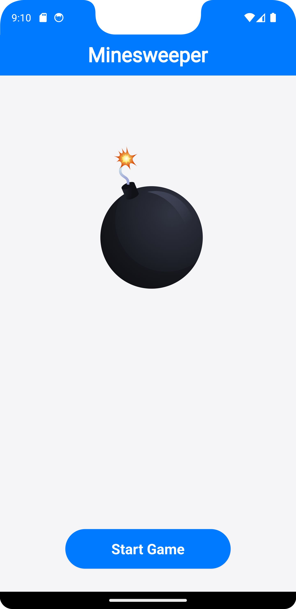
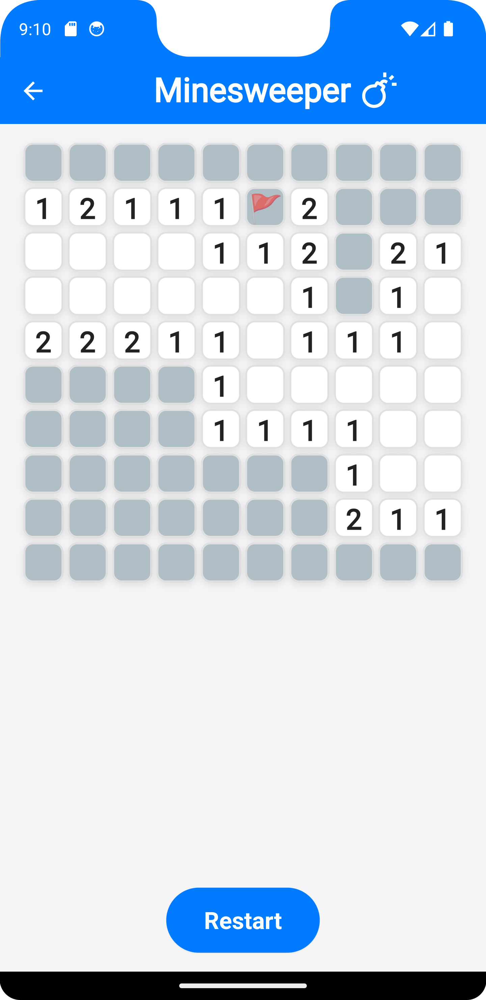

# Flutter Minesweeper

A modern Minesweeper game built with Flutter! This app features a clean UI, animations, and classic Minesweeper gameplay.

## Features

- **Dynamic Grid:** A 10x10 grid with 15 randomly placed mines.
- **Flagging:** Long-press to flag potential mines.
- **Win/Lose Alerts:** Notifications for game win or loss.
- **Lottie Animation:** Modern animated start screen.
- **Restart Option:** Restart the game at any point.
- **Provider State Management:** Manages game logic and state efficiently.

## Screenshots

### Start Screen


### Gameplay


## How to Play

1. **Start the Game:** Tap on the "Start Game" button to begin.
2. **Reveal Cells:** Tap on cells to reveal them. Avoid mines!
3. **Flag Cells:** Long-press on a cell to flag it as a mine.
4. **Win Condition:** Reveal all non-mine cells to win the game.
5. **Lose Condition:** Reveal a mine to lose the game.

## Installation

1. Clone the repository:
   ```bash
   git clone https://github.com/your-repo/flutter-minesweeper.git
   ```

2. Navigate to the project directory:
   ```bash
   cd flutter-minesweeper
   ```

3. Install dependencies:
   ```bash
   flutter pub get
   ```

4. Run the app:
   ```bash
   flutter run
   ```

## Requirements

- Flutter SDK
- Compatible with Android, iOS, and Web.

## Credits

Developed by [CodēCodes](https://www.cod-e-codes.com).

## License

This project is licensed under the MIT License.
